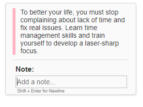

# HOW TO HIGHTLIGHT ANG TAKE NOTES ON THE INTERNET USING GLASP

## Table Of Contents

- Introduction
- What is Glaps
- Glaps Features
- How to install Glasp extension

- How to highlight text on web pages using Glasp
- Function of the different features on Glasp home page
- How to share highlighted texts on Twitter, Linkedln, Facebook and Email.

- How to highlight video on YouTube using Glasp
- Frequently asked questions
- Alternatives to Glasp
- Conclution

### INTRODUCTION

When reading an article or publication on the internet, sometimes, you come accross important information or key points that you would want to keep or remember. Sometimes, writing them on paper or on note apps can be very overwhelming. This is where Glasp - a Social Highligter for taking notes and highlighting of anything that appeals to you while reading can be of help.

In this user guide, you will learn what Glasp is, how to install it on your browser, how to use this powerful browser extension to make highlights and take note on the internet and how to generate YouTube summary using Glasp.

### WHAT IS GLASP ?

<!-- Glaps is a social web highlighter where you can highlight and organise anything that appeals to you on webpages or online PDF. You can also use it to generate  -->

Glasp is a free browser extension that enhances your online reading experience. This powerful extension helps you to highlight important text on any webpage or online PDF with colored highlighting options. These highlighted text are automatically organised and saved on Glasp home page. Your highlighted text can be tagged, linked, searched for and even shared on other platforms such as twitter, slack and the rest of them.

After you have highlighted or taken notes, the highlighted text and note appears on the sidebar of the web and when you click on your highlighted text, it takes you to the place you highlighted on the web page. Glaps helps you keep or retain important information for future use and saves your time. It has user-friendly interface and meets all your hightlighting needs.

Glasp has a youtube summary feature that uses artifical intelligence (AI) to generate youtube video transcript. You can highlight and save text or even share on other platforms.

### GLASP FEATURES

Glasp is an Artificial intelligence technology (AI), it's features are constantly updated to meet current trends or the needs of users. Below are the list of current features on Glaps :

1. Summarization : Glasp automatically generates the summary of Youtube video and displays them in text format on a different panel next to the video.
2. Supports different languages : Glasp supports different languages such as English, French, German, Italian, Portuguese and Spanish.
3. Highlighting : You can highlight key points of a video or online articles and PDF.
4. Sharing : you can share highlighted texts on other plateforms such as Twitter, Facebook, Instagram, Linkeln and Email.

### HOW TO INSTALL GLASP EXTENSION

Below are steps on how to install Glasps extension on your browser

1.  Choose any browser of your choice, it can be Google Chrome, Safari, Microsoft Edge, Explorer Brave and so on.
2.  On you search tap, type "glasp.co" and click on your enter keyboard. This will take you the Glasp webpage. Or click on https://glasp.co/ .

3.  Click on "Sign-up (beta).

4. Click on "continue with Google" and it takes you to Glasp home page.

### HOW TO HIGHLIGHT TEXT ON WEB PAGES USING GLASP

1. Go to the web page you want to read.

   

2. To highlight, select any text of your choice.

3. Select, any color you want to make highlight with.

   

   

   

4. To take note, select text and click on the write icon, this provides a section for you to take note.

5. Next, your texts gets hightlighted and a note box on the sidebar where you can take your note.

6. All the highligted text and notes can be found on the page right-side bar of your web page

7. To share your notes or highlights on twitter, add a note, create a highlight image, copy highlight embed code or delete highlight, hover over your highlights on the right-side of your web page, a three-dot icon will immediatly pop up, click on it.

8. To add tags to your highlights, click on the tag icon and tag.
   
   

9. To navigate to your home page, click on the home icon located at the right side of your browser side bar. You will be taken to your home page

   

Your home page will look like the image below

### FUNCTION OF DIFFRENT FEATURES ON GLASP HOME PAGE

1.  Your Topics let you choose topics that interest you, examples of such topics are : Career, Productivity, UX, Life Lessons and the rest of them
2.  Recommended Topics shows suggested topics for you to follow.
3.  Who to follow suggest people you can follow
4.  Following allows you to see the highlights and notes of people you are following.
5.  Topics shows contents related to your interest.
6.  Popular shows contents that people highlighted more.
7.  Community page shows top highlights and comments.
8.  Highlights shows the number of web pages you have visite, the number of highlights and notes you took,favoright highlights, saved highlights and videos. To see your highlight, click on "My Highlight" located at the top of your home page, this takes you to your highlights.

Your highlight page should look like the image below

9. The explore page let you find contents that interest you from the community. To navigate to the explore page, click on "Explore" located at the top of the home page, this takes you to the explore page.

   

Your explore page will look like the one below.

### HOW TO SHARE HIGHLIGHTED TEXTS ON TWITTER, LINKEDLN, FACEBOOK AND EMAIL

<!-- To share highlighted texts or notes on the other plateforms like Twitter, Linkedln, Facebook and Email : -->

On the web page you took your highlights and notes :

1. Click on the icon located at the top of the browser side-bar.

   

2. Next, a drop-down that shows other plataforms you want to share your highlighted text with pop up. Select the the plateform you want from there. If you want to share link, click on "COPY LINK" and share on other plateforms.

   

To share your hightlight with beautiful image :

1. Hover over your highlights on the right-side of your web page, a three-dot icon will immediatly pop up, click on it.

2. Click on "Create Hightlight Image"

   

3. Your highlight image pops out. You can select any background color of your choice, download and also share on social media.

   

How to highlight and take notes on online PDF using Glasp

### HOW TO HIGHTLIGHT VIDEO ON YOUTUBE USING GLASP

1. Open any youtube video of your choice.
   
2. Click on the arrow-down icon located at the top-left.
   

When you click on the icon,you will see all the transcript and the time done.

3. when you select any text that ineterest you, you will see a pop-up with diferent hightlighting colors, click on any of the color.
   

4. To see the texts you highlighted, click on Glasp icon located at the top-right.
   

To copy and paste all the video transcript to a note taking app :

- click on the copy icon located at top right

  

- paste on any note taking app of your choice

### FREQUENTLY ASKED QUESTIONS
 **Is Glasp free ?**
   
  Yes, Glasp is currently a free tool.

  **How does Glasp summerize a video**

  Glasp summarizes a video using artificial intelligence (AI) algorithms. This AI search for the key points in the visual and audio content of a video and then, generate and converts these keys points in text format.

  **Is it possible to customize the summary generated by Glasp**
  
  yes it is, you can do this by selecting the points you want to customize, copy the generates texts  and then, customize it in your text editor.

  **Does Glasp work with all YouTube videos?**

  No, it does not due to the fact that some videos are not compatible with the tool. Furthermore, Glasp may not be able to generate accurate summary for videos with poor audio and video quality.  

  **Is Glasp's summary accurate?**

  Video summaries are generated using AI features with is accurate. However, the summary generated also depends on the quality of the audio and video content.

  **Can I use Glasp on my mobile device**

  No, Glasp is currently not compatible on mobile devices. Glasp is a browser extension that is currently compatible with Google Chrome.

  **Can I share the summary generated by Glasp?**

  yes, you can do this by copying and pasting of the generated summary. You can also share link to the summary generated.

  ### 
  
  

