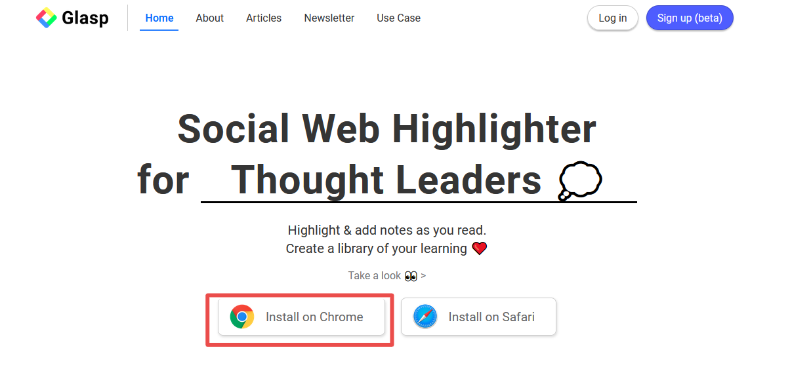
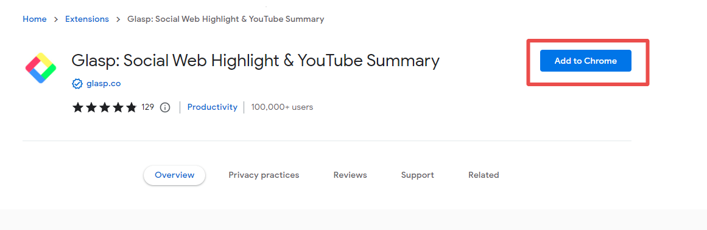
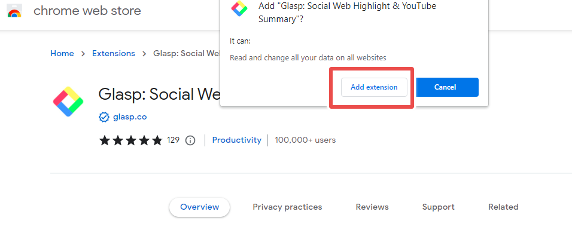
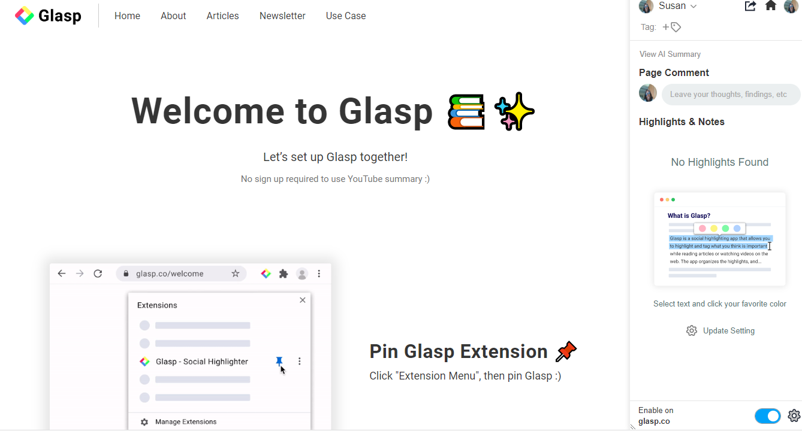
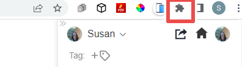
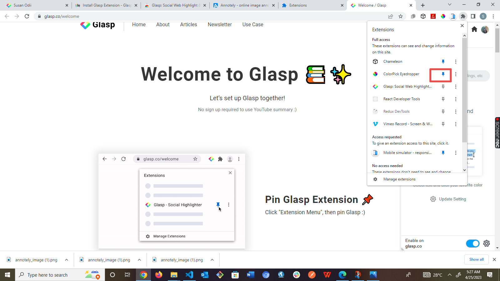

# HOW TO HIGHTLIGHT ANG TAKE NOTES ON THE INTERNET USING GLASP

## Table Of Contents

- Introduction
- What is Glasp
- Glasp Features
- How to install Glasp extension

- How to highlight text on web pages using Glasp
- Function of  different features on Glasp home page
- How to share highlighted texts on Twitter, Linkedln, Facebook and Email

- How to highlight video on YouTube using Glasp
- Frequently asked questions
 -  Glasp alternatives
 -  Limitations of Glasp
- Conclution

### INTRODUCTION

When reading an article or publication on the internet, sometimes, you come across important information or key points that you would want to keep or remember for later use. However, writing these key points on paper or on note apps in an organized manner can be very overwhelming . This is where Glasp - a social highligter for taking notes and highlighting of anything that appeals to you on a web page while reading can be of help.

In this user guide, you will learn what Glasp is, how to install it on your browser, how to use this powerful browser extension to make highlights and take note on the internet and how to generate YouTube summary using Glasp.

### WHAT IS GLASP ?

Glasp is a free browser extension that enhances your online reading experience. This powerful extension helps you to highlight important text on any webpage or online PDF with colored highlighting options. These highlighted text are automatically organised and saved on Glasp home page. Highlighted text can be tagged, linked, searched for and even shared on other platforms such as twitter, slack and more.

Glasp helps you keep or retain important information for future use. It has user-friendly interface and meets all your hightlighting needs.

Glasp has a youtube summary feature that uses artifical intelligence (AI) to generate youtube video transcript. You can highlight and save video summeries or even share on other platforms.

### GLASP FEATURES

Glasp is an Artificial intelligence technology (AI). It's features are constantly updated to meet current trends or the needs of users. Below are the list of current features on Glasp :

1. Summarization : Glasp automatically generates the summary of Youtube video and displays them in text format on a different panel next to the video.
2. Supports different languages : Glasp supports different languages such as English, French, German, Italian, Portuguese and Spanish.
3. Highlighting : You can highlight key points of a video or online articles, PDF and more.
4. Sharing : you can share highlighted texts on other platforms such as Twitter, Facebook, Instagram, Linkeln and Email.

### HOW TO INSTALL GLASP EXTENSION

Below are steps on how to install Glasp on your browser:

<!-- 1.  Choose any browser of your choice, it can be Google Chrome, Safari, Microsoft Edge, Explorer Brave and so on. -->
1. Open Google Chrome browser on your computer
2. Click on https://glasp.co/ .  This will take you to Glasp official website.

<!--  -->

3.  Click on "Install on Chrome".

<!--  -->

4. You will be taken to Chrome web store. 

  Click on the "Add to Chrome".
<!--  -->
<!--  -->

5. Next, a pop up will appear, click on "Add extension".

 Wait for the installation which will take few seconds. After installation, you will be taken to your Glasp dashboard.
 

  6. For easy access, pin the extention to your Chrome tool bar. To do this:
- Click on your Chrome extention icon.

- A drop - down with different extentions will pop up. Click on the pin icon beside you Glasp extention.
  
  

After clicking on the icon, Glasp extention will appear on your browser tool bar for easy access.

### HOW TO HIGHLIGHT TEXT ON WEB PAGES USING GLASP

1. Go to the web page you want to read and highlight.

   

2. To highlight, select any text of your choice.

3. Select, any color you want to make highlight with.

   

   

   

4. To take note, select text and click on the write icon, this provides a section for you to take note.

1. Next, your texts gets hightlighted and a note box on the browser sidebar will appear.

6. All the highligted text and notes can be found on the page right-side bar of your web page

7. To share your notes or highlights on twitter, add a note, create a highlight image, copy highlight embeded code or delete highlight, hover over your highlights on the right-side of your web page, a three-dot icon will immediatly pop up, click on it.

8. To add tags to your highlights, click on the tag icon aand add your tag text.
   

   

9. To navigate to the home page, click on the home icon located at the right side of your browser side bar. You will be taken to your profile page.

   

Your home page will look like the image below

### FUNCTION OF DIFFERENT FEATURES ON GLASP HOME PAGE

1.  **Your Topics** let you choose topics that interest you, examples of such topics are : Career, Productivity, UX, Life Lessons and so on.

2.  **Recommended Topics** shows suggested topics for you to follow.

3.  **Who to follow** suggest people you can follow. You can also search for people to follow on the search bar. When you follow someone, you will be able to see all their highlights and notes.

4.  **Following allows** you to see the highlights and notes of people you are following.You can follow people with like minds, this allows you to see all their highlights.

5.  **Topics** shows contents related to your interest.It shows topics you can follow. You are free to add or remove topics.

6.  **Popular** shows contents that people highlighted more. Contents that have more highlights are displayed on "Popular".

7.  **Community page** shows top highlights and comments.

8. **My Highlights** shows your Glasp profile, highlighted texts and the number of web pages you have visited. This section also shows,favourite highlights, saved highlights and videos. To see your highlight, click on "My Highlight" located at the top of your home page, this takes you to your highlights.

Your highlight page should look like the image below.

9. **The explore** page let you find contents that interest you from the community. To navigate to the explore page, click on "Explore" located at the top of the home page, this takes you to the explore page.

   

Your explore page will look like the one below.

### HOW TO SHARE HIGHLIGHTED TEXTS ON TWITTER, LINKEDLN, FACEBOOK AND EMAIL

<!-- To share highlighted texts or notes on the other plateforms like Twitter, Linkedln, Facebook and Email : -->

On the web page you took your highlights and notes :

1. Click on the icon located at the top of the browser side-bar.

   

2. Next, a drop-down menu that shows different platforms you want to share your highlighted text will pop-up. Select the the plateform you want from there. If you want to share link, click on "COPY LINK" and share on other plateforms.

   

To share hightlight with beautiful image :

1. Hover over your highlights on the right-side of your web page, a three-dot icon will immediately pop up, click on it.

2. Click on "Create Hightlight Image"

   

3. Your highlight image will pop up. You can select any background color of your choice, download and also share on social media.

   

### HOW TO HIGHTLIGHT VIDEO ON YOUTUBE USING GLASP

1. Open any youtube video of your choice.
   
2. Click on the arrow-down icon located at the top-left.
   

When you click on the icon,you will see all the transcript and the time done.

3.Select any text that interest you. After selecting, you will see a pop-up with different hightlighting colors, click on any of the color.
   

4. To see the texts you highlighted, click on Glasp icon located at the top-right.
   

To copy and paste all the video transcript to a note taking app :

- Click on the copy icon located at top right.

  

- Paste on any note taking app of your choice

### FREQUENTLY ASKED QUESTIONS
 **Is Glasp free ?**
   
  Yes, Glasp is currently a free tool.

  **How does Glasp summerize a video**

  Glasp summarizes a video using artificial intelligence (AI) algorithms. This AI search for the key points in the visual and audio content of a video and then, generateS and converts these keys points to text.

  **Is it possible to customize the summary generated by Glasp**
  
  yes it is, you can do this by selecting the points you want to customize, copy the generated texts  and finally, customize it in your text editor.

  **Does Glasp work with all YouTube videos?**

  No, it does not due to the fact that some videos are not compatible with the tool. Furthermore, Glasp may not be able to generate accurate summary for videos with poor audio and video quality.  

  **Is Glasp's summary accurate?**

  Video summaries are generated using AI features which is accurate. However, the summary generated also depends on the quality of the audio and video content.

  **Can I use Glasp on my mobile device**

  No, Glasp is currently not compatible on mobile devices. Glasp is a browser extension that is currently compatible with Google Chrome.

  **Can I share the summary generated by Glasp?**

  yes, you can do this by copying and pasting of the generated summary. You can also share link to the summary generated.

   ###  GLASP ALTERNATIVES
  1. Pocket : It is a tool used to save  articles and videos for later use. Saved articles and videos are accessible on phone, tablet or computer.
  2. Diigo : It is used for bookmarking and annotation on a web page. It  allows you to highlight and add comments on a web page in an organized way.
  3. Hypothesis :It is an open source software used for annotating web pages, PDF's and other online contents collaboratively. This tool allows users to highlight, tag and add comments on what they read online and highlights can be viewed, analized and replied to by others in the group.

   4. Linear : It is a tool used for highlighting articles, YouTube, images and PDF's. Your highlights are stored for future use.
Linear also uses AI to generate answers to questions asked on the web.

   
### LIMITATIONS OF GLASP
1. Glasp can not be used on mobile devices
2. Some video contents and PDF'S can not be accessed by Glasp.
    

### CONCLUSION

Glasp is a powerful tool that can help improve your reading and learning experience. It is a social highlighter for highlighting and taking notes on web pages, PDF's , videos and other online contents. Glasp allows you to share these highlights and notes on other platforms like Twitter. You can also collaborate with people on Glasp. All highlights and notes are securely saved for future use or reference. Glasp helps you to organise anything you read on the internet.

Glasp is a great tool for students, reseachers, developers, designers and anybody who has passion for learning and growing.

